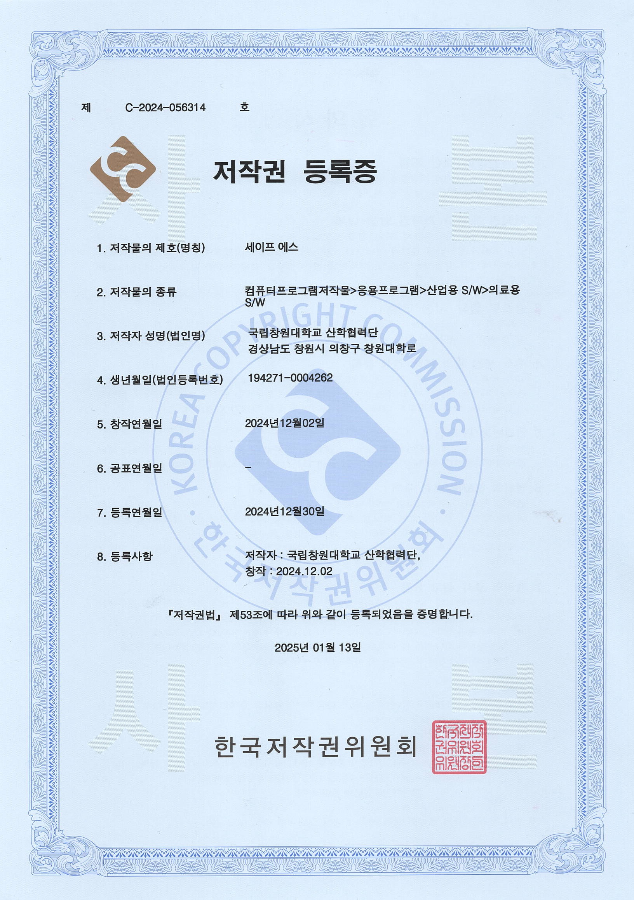
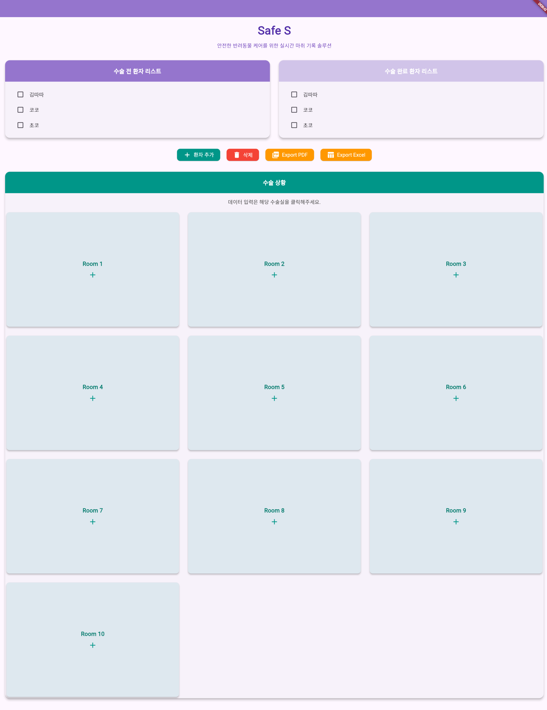
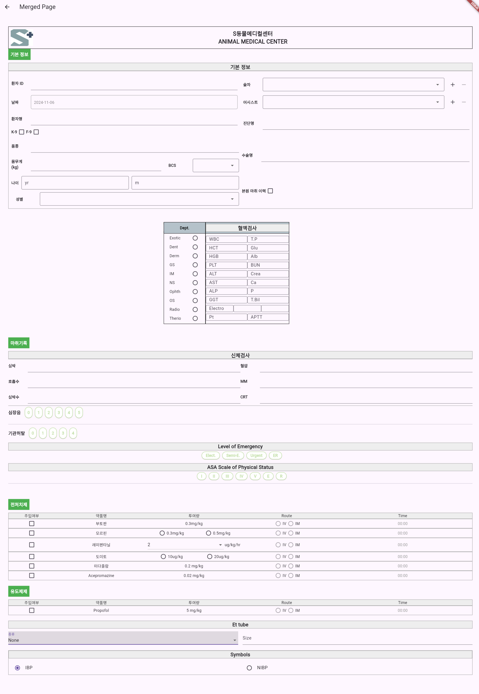

# 🐾 SAFE S Viewer

> **동물병원 수술 마취 기록용 웹 반응형 애플리케이션**  
> 수술 중 환자 상태, 마취 기록, 검사 결과, 이벤트, 그래프 데이터를 통합 관리하기 위한 실시간 마취 기록 솔루션입니다.

---

## 📌 Project Overview

**SAFE S Viewer**는 동물병원 수술실에서 사용하는 **수술·마취 기록 관리용 웹 반응형 애플리케이션**입니다.

수술 중 환자의 상태 변화, 마취 기록, 추가 약물 투여, 이벤트 발생, 검사 결과, 그래프 데이터를 하나의 화면에서 관리할 수 있도록 설계했습니다.

기존 종이 기반 기록 또는 분산된 검사 자료 관리 방식에서는 수술 중 실시간 기록, 수정 이력 관리, 수술방별 접근 제어, PDF 검사 결과 관리가 어렵다는 문제가 있었습니다.

SAFE S Viewer는 이러한 문제를 해결하기 위해 수술방 단위의 기록 관리, 실시간 데이터 입력, 환자 정보 연동, Chart 기반 생체 데이터 표시, Session 기반 접근 제어 기능을 중심으로 개발되었습니다.

---

## 🏷️ Copyright & Repository Policy

SAFE S Viewer는 동물병원 수술 마취 기록용 웹 반응형 애플리케이션으로,  
한국저작권위원회에 컴퓨터프로그램저작물로 등록된 프로젝트입니다.

- 저작물명: 세이프 에스
- 등록번호: C-2024-056314
- 등록일: 2024.12.30
- 공식 등록 조회: https://www.cros.or.kr/psnsys/cmmn/infoPage.do?w2xPath=/ui/twc/cmmn/convenientDtl.xml&regId=C-2024-056314

<p align="center">
  
</p>

<p align="center">
  <em>SAFE S Viewer copyright registration certificate</em>
</p>

현재 소스코드는 팀 프로젝트 및 지식재산권 관리 정책에 따라 비공개 저장소에서 관리하고 있으며,  
본 레포지토리는 포트폴리오 목적으로 프로젝트 개요, 주요 기능, 기술 스택, 개발 흐름을 정리한 소개용 문서입니다.

---

## 🖼️ Preview

<p align="center">
  
</p>

<p align="center">
  <em>SAFE S Viewer main screen preview</em>
</p>


<p align="center">
  
</p>

<p align="center">
  <em>SAFE S Viewer main screen preview2</em>
</p>
---

## 👥 Team

| Role | Name |
|---|---|
| Team Lead | 오민정 |
| Team Member | 김태수 |
| Team Member | 송준표 |
| Team Member | 서현우 |

---

## 🎯 Project Goal

본 프로젝트의 목표는 동물병원 수술 과정에서 발생하는 마취 기록 데이터를 구조화하고,  
수술 중 필요한 정보를 실시간으로 입력·조회·관리할 수 있는 웹 기반 기록 시스템을 구현하는 것입니다.

주요 목표는 다음과 같습니다.

- 수술 환자 정보와 수술방 정보 통합 관리
- 수술 중 발생하는 생체 데이터와 이벤트 기록
- 수술방별 Session 제어를 통한 Edit / Observer 권한 분리
- PDF 검사 결과를 데이터베이스에 저장 가능한 구조로 모델링
- 향후 데이터 분석을 고려한 DB 구조 설계
- PC와 Web 환경에서 모두 사용할 수 있는 반응형 UI 구성
- 수술 종료 후 PDF / Excel 형태의 기록 내보내기 기능 확장

---

## 🛠️ Tech Stack

| Category | Stack |
|---|---|
| Frontend | Flutter Web |
| Language | Dart, Python |
| Backend | FastAPI |
| Database | MariaDB |
| Realtime | WebSocket, Kafka |
| State Management | Provider |
| Chart | fl_chart |
| PDF Processing | Python PDF parsing logic |
| API Communication | HTTP, WebSocket |
| Data Format | JSON |
| Target | Web / PC Environment |

---

## 🧩 Core Features

## 1. 수술방 기반 기록 관리

SAFE S Viewer는 수술방 단위로 수술 기록을 관리합니다.

각 수술방에는 특정 Session이 할당되며, 수술방을 처음 생성한 Session은 해당 수술방의 기록을 수정할 수 있습니다.  
그 외 Session은 동일 수술방에 접근하더라도 관찰자 모드로 동작하도록 설계했습니다.

이를 통해 여러 기기가 같은 수술방 데이터를 확인하더라도, 동시에 잘못된 수정이 발생하지 않도록 접근 권한을 분리했습니다.

---

## 2. Session 기반 접근 제어

초기 페이지 접속 시 브라우저에 Session을 발급합니다.

Session은 다음 목적으로 사용됩니다.

- 사용자 접속 상태 식별
- 특정 수술방 생성 권한 확인
- 수술방 수정 권한 검증
- Edit Mode / Observer Mode 구분
- 잘못 할당된 Session 관리

수술방 생성 시 Session 유효성 검사를 수행하여,  
특정 수술방에 대한 수정 권한을 Session 단위로 제어할 수 있도록 설계했습니다.

---

## 3. 환자 정보 로드 및 수술방 생성

상단 영역에서 전체 Pet 정보를 로드하고, 선택한 환자 정보를 기반으로 수술방을 생성할 수 있도록 구현했습니다.

수술방 생성 시 환자 정보와 수술 정보가 함께 적용되도록 설계했습니다.

관리 대상 정보는 다음과 같습니다.

- 환자 번호
- 환자 이름
- 종
- 품종
- 성별
- 체중
- 보호자 정보
- 수술명
- 진료과
- 수술 상태

진료과는 일반외과, 정형외과, 안과, 치과, 영상, 방사능치료 등으로 구분하여 관리할 수 있도록 논의되었습니다.

---

## 4. 수술 정보 입력

수술 중 필요한 정보를 구조화하여 입력할 수 있도록 설계했습니다.

주요 입력 정보는 다음과 같습니다.

- 수술 전체 정보
- 환자 정보
- 수술방 정보
- 추가 약물
- 이벤트 기록
- 생체 데이터 그래프
- 접속자 Session 정보
- 변경 이력

마취 기록 특성상 시간 흐름에 따른 데이터 입력이 중요하기 때문에,  
단순 입력 폼이 아니라 Chart와 이벤트 로그를 함께 고려한 구조로 설계했습니다.

---

## 5. 실시간 Chart 데이터

수술 중 시간 경과에 따른 생체 데이터를 Chart 형태로 기록하고 조회하는 기능을 목표로 했습니다.

구현 및 논의 대상 데이터는 다음과 같습니다.

- 심박수
- 혈압
- SpO2
- 호흡
- 체온
- 기타 마취 기록 데이터

Frontend에서는 `fl_chart`를 활용하여 그래프 UI를 구성하고,  
Backend에서는 WebSocket과 Kafka 기반 구조를 통해 수술방별 실시간 데이터 전달을 고려했습니다.

---

## 6. Edit Mode / Observer Mode

수술방 데이터는 접속 Session에 따라 Edit Mode와 Observer Mode로 구분됩니다.

| Mode | Description |
|---|---|
| Edit Mode | 수술방을 생성한 Session이 데이터를 입력·수정 |
| Observer Mode | 다른 Session이 수술방 데이터를 조회 |

Edit Mode에서 입력된 데이터는 서버로 전송되고,  
Observer Mode에서는 수정 중인 데이터를 로드하여 실시간으로 확인하는 흐름을 목표로 했습니다.

---

## 7. PDF 검사 결과 관리

SAFE S Viewer는 PDF 검사 결과를 업로드하고, 해당 데이터를 DB에 저장할 수 있도록 설계되었습니다.

DB 모델링 단계에서 PDF의 모든 검사 결과를 저장할 수 있도록 구조를 설계했으며,  
이를 통해 수술 전 검사 결과와 수술 중 기록을 함께 관리할 수 있는 기반을 마련했습니다.

---

## 8. 변경 이력 관리

수술 기록은 의료 데이터 특성상 수정 이력이 중요합니다.

SAFE S Viewer는 수술 정보와 기록 변경 사항을 추적할 수 있도록 변경 이력 저장 구조를 고려했습니다.

향후 기능으로는 수술 종료 이후 수정 기능과 수정 이력 저장 기능이 포함되었습니다.

---

## 🗃️ Database Design

SAFE S Viewer는 향후 데이터 분석까지 고려하여 데이터베이스 구조를 설계했습니다.

DB 모델링에서 고려한 주요 데이터는 다음과 같습니다.

- 환자 정보
- 보호자 정보
- 수술 정보
- 수술방 정보
- 검사 결과
- 추가 약물
- 이벤트 기록
- 생체 데이터 그래프
- 접속 Session 정보
- 변경 이력

단순 기록 저장이 아니라, 이후 분석 가능한 형태로 수술·마취 기록 데이터를 구조화하는 것을 목표로 했습니다.

---

## 🔁 Realtime Data Flow

SAFE S Viewer의 실시간 데이터 흐름은 다음과 같은 구조를 목표로 했습니다.

```text
Flutter Web Client
        ↓
FastAPI Server
        ↓
WebSocket / Kafka
        ↓
Observer Client
```

수술방에서 발생한 입력 데이터는 서버로 전송되고,  
같은 수술방을 보고 있는 Observer 화면에 실시간으로 반영될 수 있도록 설계했습니다.

수술방 번호를 기준으로 메시지를 구분하여 room 단위 데이터 전달 구조를 구성하는 방향을 검토했습니다.

---

## 📄 Export Features

잔여 기능으로 다음 내보내기 기능이 논의되었습니다.

- PDF 내보내기
- Excel 내보내기

수술 종료 후 최종 확인과 서명 절차를 거쳐 기록을 확정하고,  
확정된 수술 기록을 PDF 또는 Excel 형태로 출력하는 기능을 목표로 했습니다.

---

## 🚧 Development Status

### Completed

- 데이터 분석을 고려한 DB 모델링
- PDF 검사 결과 저장을 고려한 DB 구조 설계
- Session 발급 기능
- 수술방 생성 시 Session 유효성 검사
- 상단 전체 Pet 정보 로드
- 선택한 환자 항목 기반 수술방 생성
- 수술방 데이터 적용 구조 설계

---

### In Progress

- DB 데이터를 Web 화면에 적용
- 경과 시간 기반 Chart 데이터 적용
- 수술 중 추가 시술 데이터 적용
- Edit Mode 데이터 서버 전송
- Observer Mode 데이터 로드
- 메인화면 수술 현황 주기적 업데이트
- PC에서 PDF 업로드 후 환자 리스트 업데이트

---

### Planned

- 수술 시작 / 수술 종료 / 최종확인완료 / 서명 기능
- 수술 중 추가 약물 리스트 추가·삭제
- 입력 방식 개선
- Graph Chart 상세 기능
- CPR / Death 기능
- PDF 내보내기
- Excel 내보내기
- 수술 종료 이후 수정 기능
- 화면 줌 기능
- 수정 이력 저장
- 로그인 기능
- 프록시 서버 구축

---

## 👤 My Contribution

본 프로젝트에서 저는 **수술 마취 기록 데이터의 DB 모델링 및 데이터 구조 설계**를 중심으로 참여했습니다.

SAFE S Viewer는 단순한 입력 화면이 아니라, 환자 정보, 수술 정보, 수술방 정보, 검사 결과, 약물 투여 기록, 이벤트, 생체 데이터 그래프, 접속 Session, 변경 이력 등 다양한 데이터를 함께 관리해야 하는 시스템입니다.

저는 이러한 데이터를 저장·조회·분석할 수 있도록 주요 엔티티와 관계를 정리하고, PDF 검사 결과 및 수술 중 기록 데이터를 DB에 반영하기 위한 구조 설계에 참여했습니다.

주요 기여 내용은 다음과 같습니다.

- 데이터 분석을 고려한 DB 모델링 참여
- 환자 정보, 수술 정보, 수술방 정보, 검사 결과 데이터 구조 정리
- 추가 약물, 이벤트, 그래프 데이터 저장 구조 검토
- PDF 검사 결과 저장을 위한 테이블 구조 논의
- Session 기반 수술방 접근 제어 데이터 구조 검토
- 변경 이력 저장 구조 설계 논의
- 회의자료 기반 기능 요구사항 정리 및 DB 반영 항목 도출

---

## 🧠 What I Learned

이 프로젝트를 통해 단순한 화면 구현을 넘어, 실제 현장에서 사용될 수 있는 기록 시스템을 설계할 때 고려해야 할 요소를 경험할 수 있었습니다.

특히 수술 마취 기록은 단순한 입력 폼이 아니라, 시간 흐름에 따른 데이터, 환자 정보, 약물 투여 기록, 이벤트, 검사 결과, 수정 이력, 접근 권한이 함께 관리되어야 하는 복합적인 데이터 구조라는 점을 이해했습니다.

또한 WebSocket과 Kafka를 활용한 실시간 데이터 전달 구조를 검토하면서,  
여러 사용자가 동시에 같은 수술방 데이터를 확인하는 환경에서 Edit Mode와 Observer Mode를 분리하는 것이 중요하다는 점을 배웠습니다.


---

## 📚 Keywords

- Flutter
- Flutter Web
- Dart
- FastAPI
- Python
- MariaDB
- WebSocket
- Kafka
- Provider
- fl_chart
- Veterinary EMR
- Surgery Record
- Anesthesia Record
- Realtime Chart
- Session Management
- PDF Processing
- Responsive Web App
- Healthcare Data

